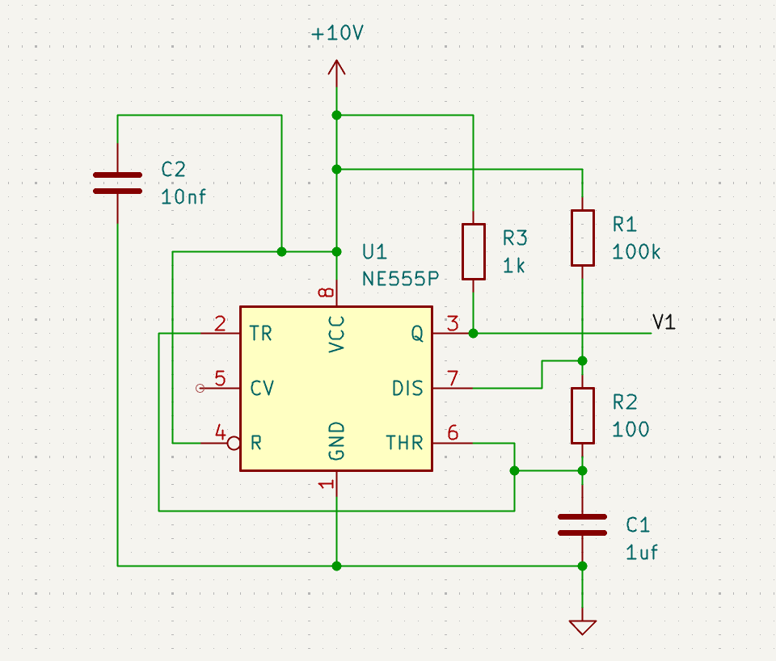
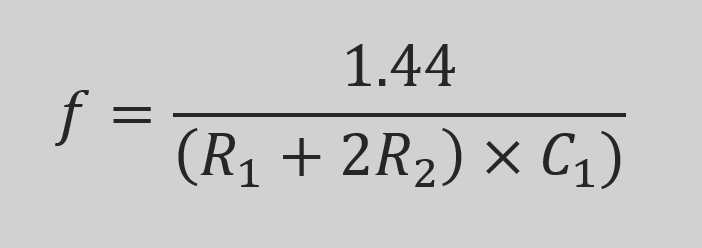

# Analog TENS Circuit
This project is based on a TENS (Transcutaneous Electrical Nerve Stimulation) unit, which is used to temporarily treat chronic or acute pain by delivering low-voltage electrical currents to the affected area through the skin.
## Waveform Generation
- An astable 555 timer circuit was first designed to generate a pulse train with the desired frequency.

- The timing resistors were adjusted for the desired frequency.

- This signal was used to trigger a monostable 555 timer, configured to produce a pulse of the desired width on each falling edge.
- A differentiator circuit was then used to extract the falling edge of the monostable output, which was used to trigger a second monostable timer, producing an equal-width pulse.
- The timing resistors of the monostable stage circuit were adjusted for the desired pulse width.
- Final waveform was produced with a pulse width of about 200 &micro;s at a frequency of 14 Hz.
## Signal Conditioning
- The output signal from the first monostable timer is fed into a non-inverting operational amplifier to buffer and isolate the waveform.
- The signal from the second monostable timer is passed through an inverting operational amplifier to produce a polarity-reversed pulse.
- Both amplifier outputs are routed through current-limiting resistors to ensure safe delivery of the stimulation pulses.
- The circuit was simulated in LTspice with various output loads between 1 k&Omega; and 10 k&Omega; (representing typical skin resistance), verifying that the maximum output current remained below 3.5 mA.
## PCB Layout
The schematic was converted into a dual-layer PCB layout, designed for reliable hardware testing and future prototyping. 
